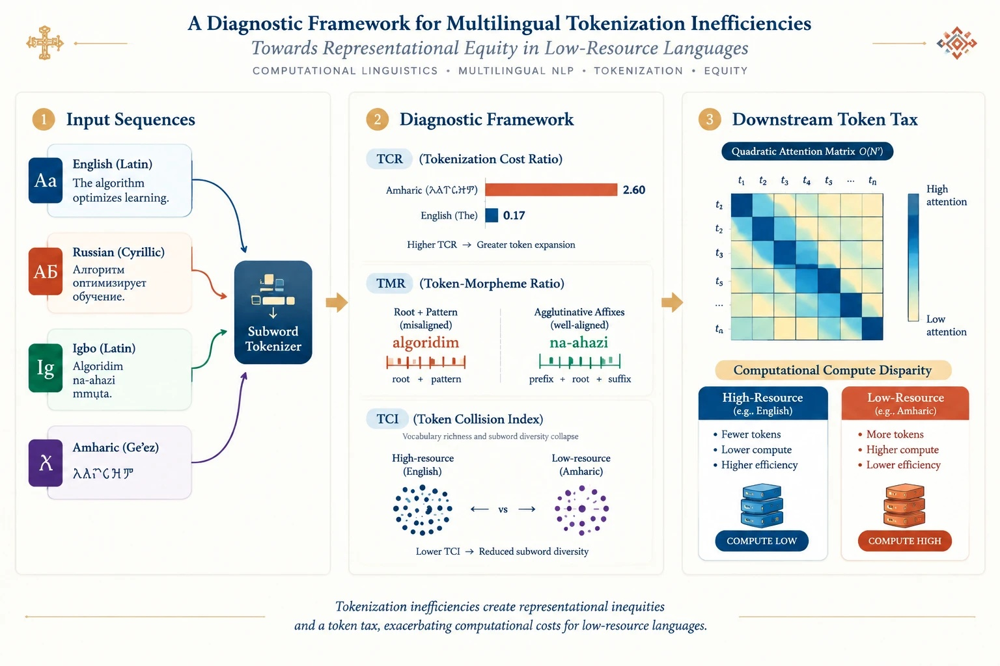
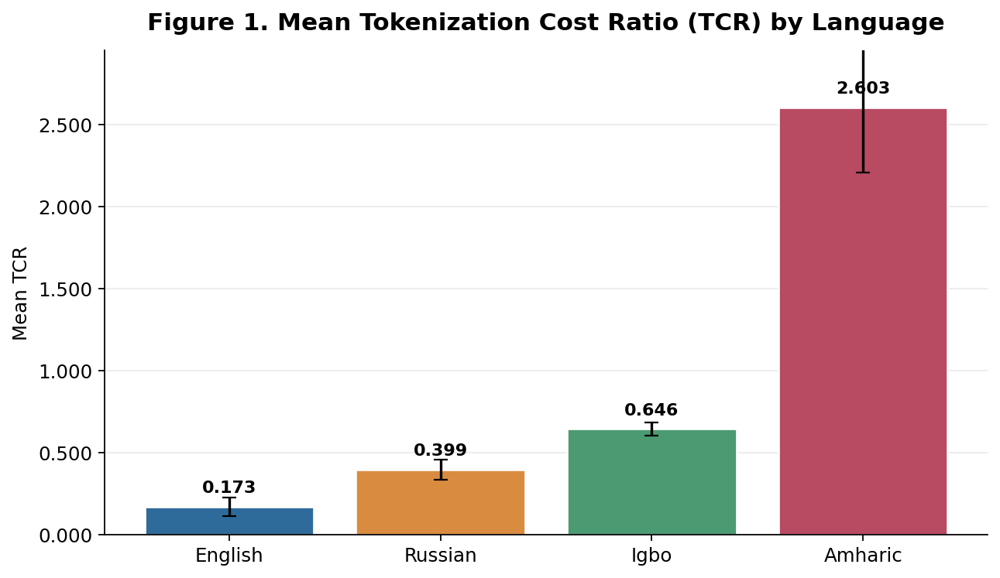
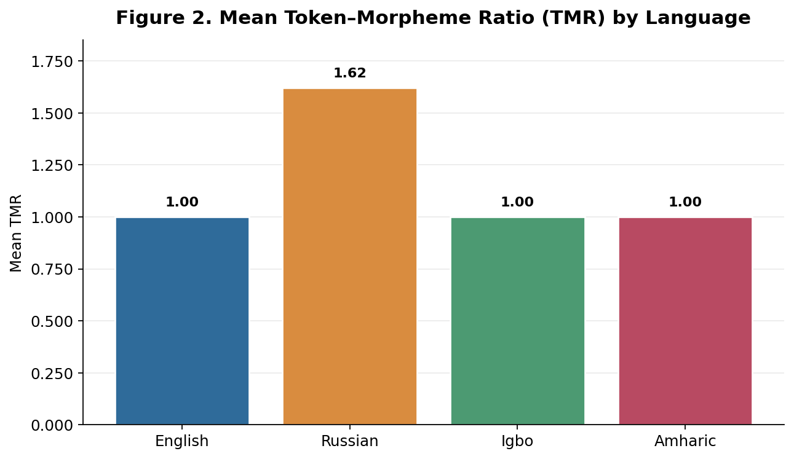
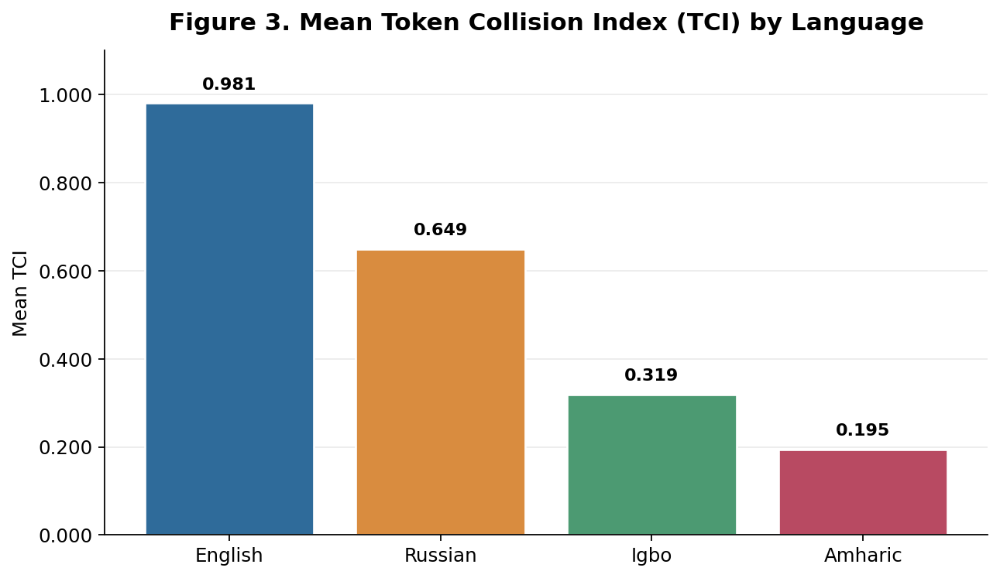
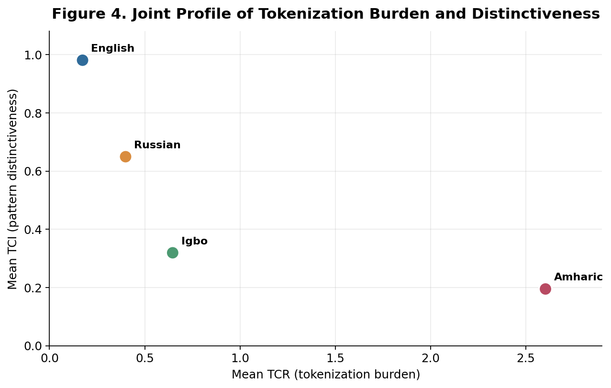
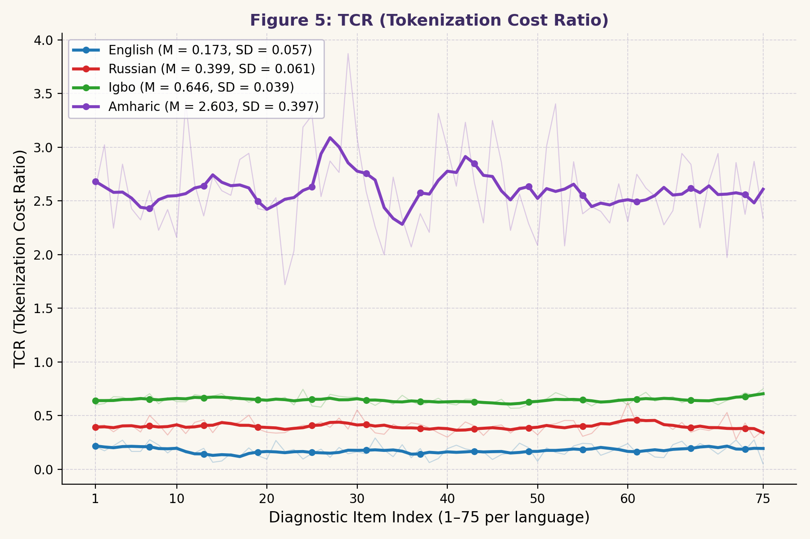

# Beyond the Subword Bottleneck: Quantifying Multilingual Tokenization Disparities

This repository contains the curated datasets, diagnostic framework, and analysis artifacts for the paper: *"Beyond the Subword Bottleneck: A Diagnostic Tri-Metric Evaluation of Cross-Lingual Tokenization Inefficiencies."*

---

## 📑 Table of Contents
1. [Overview & Graphical Abstract](#overview--graphical-abstract)
2. [Diagnostic Figures](#diagnostic-figures)
3. [Empirical Summary](#empirical-summary)
4. [Repository Structure](#repository-structure)
5. [Key Research Conclusions](#key-research-conclusions)
6. [Citation](#citation)

---

## 🔬 Overview & Graphical Abstract
This project evaluates the structural and computational disparities introduced by subword tokenizers across typologically diverse languages (English, Russian, Igbo, and Amharic).

<div align="center">
  
  <p><em>Figure 0: Graphical Abstract – Multilingual Tokenization Bottleneck and Diagnostic Workflow.</em></p>
</div>

---

## 📊 Diagnostic Figures
The following figures illustrate the performance metrics across the evaluated languages.

| Tokenization Cost Ratio (TCR) | Token-Morpheme Ratio (TMR) |
| :---: | :---: |
|  |  |
| *Figure 1: Mean TCR* | *Figure 2: Mean TMR* |

| Token Collision Index (TCI) | Diagnostic Quadrant Profile |
| :---: | :---: |
|  |  |
| *Figure 3: Mean TCI* | *Figure 4: TCR vs. TCI Joint Profile* |

<div align="center">
  <p><strong>Figure 5: TCR vs. Sequence Length Analysis</strong></p>
  
</div>

---

## 📈 Empirical Summary
Aggregate metrics for the evaluated languages ($N=300$):

| Language | Mean TCR | Mean TMR | Mean TCI |
| :--- | :---: | :---: | :---: |
| **English** | 0.1735 | 1.0000 | 0.9807 |
| **Russian** | 0.3994 | 1.6200 | 0.6493 |
| **Igbo** | 0.6464 | 1.0000 | 0.3192 |
| **Amharic** | 2.6033 | 1.0000 | 0.1948 |

---

## 🌲 Repository Structure
```text
Beyond-Subword-Bottleneck/
├── Figures/
│   ├── graphical_abstract.jpg
│   ├── Figure_1_TCR.png
│   ├── Figure_2_TMR.png
│   ├── Figure_3_TCI.png
│   ├── Figure_4_TCR_TCI_Profile.png
│   └── figure5_TCR.png
├── config/              # Experiment configurations and schema
├── processed_data/      # Analyzed CSV datasets
├── README.md            # Project documentation
└── LICENSE
